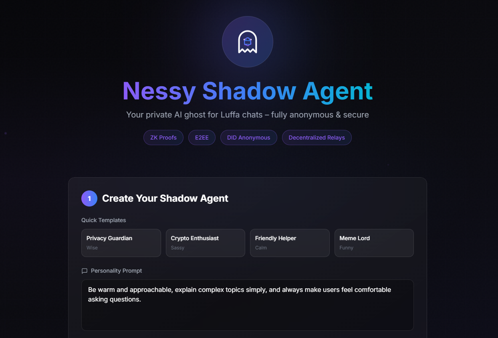

# Nessy Shadow Agent – Privacy-Preserving AI Ghost for Luffa

A proof-of-concept mini-app that lets Nessy holders create a "Shadow Agent" – an anonymous AI ghost that auto-replies in Luffa chats when offline. All agent behavior and data are fully protected by ZK proofs + E2EE + DID + decentralized relays – no identity leak.

**Live Demo:** https://nessy-shadow-agent.vercel.app/



## What It Does
This tool allows users to:
- Define agent personality & tone (Sassy, Wise, Funny, Calm)
- Generate a private Shadow Agent using mock AI logic
- Preview & test in a simulated Luffa chat (user types → agent replies with ghost effect)
- "Deploy" mock agent with success animation (Nessy flies in + confetti)
- Toggle privacy demo: "Without ZK" (exposed) vs "With ZK" (hidden & secure)

Nessy appears as a translucent ghost in chat bubbles when replying – only the owner knows it's them.

## Why It Matters to the Endless Ecosystem
- **Combines Nessy IP + AI agents + ZK privacy**: Turns Nessy from mascot into a "living" privacy tool.
- **Increases Luffa retention**: Users stay connected even offline via their own ghost agent.
- **Showcases advanced privacy**: ZK proofs ensure anonymity, E2EE protects messages, DID owns identity – aligns with Endless core mission.
- **Viral potential**: Holders can share "ghost replies" screenshots → boosts Nessy engagement & community growth.
- **Scalable innovation**: Can evolve into real on-chain agent with royalties from fan usage or governance utilities.

## Features (MVP)
- Personality prompt + tone selection
- Simulated Luffa chat with ghost Nessy replies
- Mock ZK proof generation (text animation "Anonymity Verified")
- Responsive dark-mode UI (Endless aesthetic: purple-black-blue-white)
- Pure React + Tailwind CSS + Framer Motion – easy to extend

## How to Run / Test
1. Clone the repo:
   ```bash
   git clone https://github.com/duchth1993/nessy-shadow-agent.git
2. Install dependencies:
   ```bash
   npm install
3. Run locally:
   ```bash
   npm run dev
4. Or visit live demo: https://nessy-shadow-agent.vercel.app/

Future Improvements:
- Integrate real Endless SDK for DID auth & E2EE chat
- Add ZK-SNARKS for verifiable anonymous replies
- On-chain agent deployment mock (testnet)
- Royalty system for fan-created agent personalities
- Shareable ghost reply screenshots (with privacy watermark)

Built for Endless Monthly Contribution Program for Developers
Submission for: March 2026 cycle @EndlessProtocol @EndlessDevTeam #EndlessDev 
Made with for privacy-first AI agents & Nessy IP
Repo: https://github.com/duchth1993/nessy-shadow-agent


